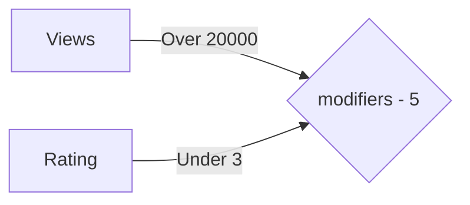
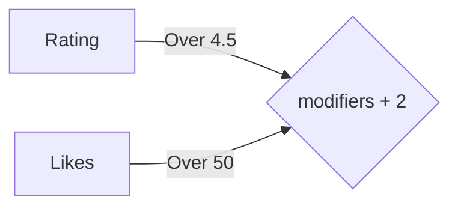

# F95Zone++

[GreasyFork](https://greasyfork.org/en/scripts/560087-f95zone) | [Direct](https://github.com/Ozzymand/f95zonepp/raw/refs/heads/main/f95zonepp.user.js)

1. [Features](#features)
2. [Math](#the-underlying-math)

### Features

* Popularity based game card highlighting [(Math)](#the-underlying-math)
* Tag based highlighting (WIP 🚧)

### The underlying math

In order to score a game and it's popularity, we set some weights for the 3 variables we take into consideration: views, likes and rating. These are used to scale the overall score depending on the user preference, i.e. if the user prefers games with higher ratings and does not care for likes, these variables can be modified to suggest those types of games.

The score is calculated using the following formula

$$views_{w} = log_{10}(views + 1) \cdot views\_weight$$
$$likes_{w} = log_{10}(likes + 1) \cdot likes\_weight$$
$$rating_{w} = rating \cdot rating\_weight$$

$$base\_score = views_{w}+likes_{w}+rating_{w}$$
This usually yields a score within the boundry of [0, 35) but on top of this a modifier is applied for specific situations. We get a rating for **engagement** (likes per view), **clickbait** penalty (low rating per views), and a final **community loved** boost. 

$$modifiers = engagement = {likes \over views} \Rightarrow 3\pm1$$

$$total\_score = base\_score + modifiers$$

The final score is compressed into 5 different categories with the following conversion table

| Score | Classifier | Name   |
|-------|------------|--------|
| >= 27 |      4     | High   |
| >= 25 |      3     | Medium |
| >= 15 |      2     | Low    |
| >= 9  |      1     | Bad    |
| <= 8  |      0     | New    |

As you can see, a score of 8 or lower is given the name of New since those games usually tend to lack enough community engagement to make a fair assumption. Getting a score this low is usually because of 0 reviews or 0 likes. 
